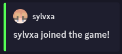

# Extra Setup

This section will cover how to get some of the extra features of Dissonance working.

## Linking

Discord linking allows for two features currently: Whitelisting and Proximity Chat

For any of these features to work, you need to set the following options:

```toml
[discord.linking]
enabled = true
guild_id = SERVER_ID
```

Where `SERVER_ID` is the ID of your Discord server (if this is set to 0, it will default to the server ID that contains your output channel)

If the whitelist is enabled, players will be prompted to link their account when they join the Minecraft server for the first time. Otherwise, they can do it in-game with `/dissonance link`. They will be given a 6-digit code that they can use with the `/link` slash command on Discord.

Players can unlink their accounts either by the Discord slash command `/unlink` or the in-game command `/dissonance unlink`.

> NOTE: Permissions for Discord commands are not implemented yet, but if you have a use-case for limiting (un)linking commands, let <a href="https://sylvie.lol/" target="_blank">me</a> know!

### Whitelist

You can enable a whitelist so only members who are in your Discord server (or have/do not have a role) may join.

> If this is enabled while the `guild_id` is invalid, players won't be able to join the server. This is to make sure nobody can take advantage of a configuration error and get on to your server without permission! 

Here are the configuration options:

```toml
[discord.linking.whitelist]
enabled = false
kick_message = "§cYou are not allowed to join this server!"
allowed_roles = []
disallowed_roles = []
link_message = """
§c§lThis server requires that you link with their Discord to join!

§7Run the §i/link §r§7command with the code §l%code%§r§7 to link your account."""
```

Setting `enabled` to true without any allowed roles will mean *anyone* in your Discord server can join. Adding IDs to the allowed role lists (`allowed_roles = [1282070494035709983]`) enables the role whitelist, which means nobody except operators, in-game whitelisted players, and those with the allowed roles can join.

The role blacklist works the same, however it takes priority over the allowed role list. This means a player can have an allowed role and still be blocked from joining the Minecraft server because they have a disallowed one. Keep it in mind that the Minecraft whitelist takes priority over all Dissonance white/blacklists.

### Proximity

Channel-based proximity chat, inspired by [DiscordSRV](https://modrinth.com/plugin/discordsrv)'s implementation, automatically creates voice channels for and moves players together that are close to each other in-game.

> Unfortunately, there is no volume falloff with this approach, and if it's possible to use something like [Simple Voice Chat](https://modrinth.com/plugin/simple-voice-chat) I would recommend that instead. This works server-side though, so if you are aiming for Geyser support this is as good as it's going to get for you!

> THIS IS SUPER DUPER EXPERIMENTAL AS OF 11/17/25

Here are the configuration options:
```toml
[discord.linking.proximity]
enabled = false
category_id = 0
lobby_id = 0
range = 48
grace = 8
frequency = 20
mute_lobby_members = true
```

You **must** create a Discord channel category and lobby voice channel for this functionality to work. Set the `category_id` and `lobby_id` to their respective snowflake IDs, and make sure to disable the `Speak` permission on the lobby channel for players. For `mute_lobby_members` to work correctly, you must give the bot the `Manage Permissions` and `Mute Members` permissions for the category.

> WARNING! Any other voice channels in the proximity category will be deleted when the server restarts (in case the server crashes and there are left over channels).

The `range` field is the distance in blocks that players will have to be in to hear eachother. 

The `grace` field is the distance a player can leave that field before being kicked out of a group (this avoids rapid channel creation/deletion and thus ratelimiting).

The `frequency` option is how many ticks pass between proximity group updates. If you have a lot of players and are running into Discord rate limit issues, increase this. Generally, I recommend going lower than `20`, but if you need faster updates you can set it lower.

The `mute_lobby_members` option decides if members should be server muted in the lobby. This requires that the bot has both the `Manage Permissions` and `Mute Members` permissions for the category.

## Activity

The Discord bot may have an activity (a.k.a. status or presence) that updates on a given interval

Here are the configuration options:

```toml
[discord.activity]
enabled = true
#Valid types: PLAYING, STREAMING, LISTENING, WATCHING, CUSTOM_STATUS, COMPETING
type = "PLAYING"
#Placeholders: %players%, %max%
template = "Minecraft (%players%/%max%)"
streaming_url = "https://www.twitch.tv/sylvxa"
update_frequency = 60
```

The `type` field dictates how the Discord activity is displayed. `STREAMING`, for example, will display a purple arrow next to the bots name in the member list and have a button that links to the `streaming_url`.

The `template` field is the message that goes with the activity.

The `streaming_url` is the URL that will be linked if the `type` is `STREAMING`

The `update_frequency` is the time, in seconds, between activity updates.

## Events

Events in the context of Dissonance are any in-game events that trigger a Discord message. Their configuration options are under `minecraft.events`.

Here are the global configuration options:
```toml
[minecraft.events]
use_webhook_for_events = false
nickname_authors = true
```

The `use_webhook_for_events` field decides if the same webhook used for player messages should also be used for event messages. This is largely unnecessary unless there is some permission issues in your server.

The `nickname_authors` field decides if a player's *display name* should be used for embed author names. This does nothing without some sort of nickname mod.

Each event also shares the following options:

```toml
[minecraft.events.event_name]
enabled = true
use_embed = true
use_player_author = true
title = "EVENT_TITLE"
description = "EVENT_DESCRIPTION"
color = "#55FF55"
```



Every event has a list of placeholders before it inside of the config file that can be used in the `title` and `description` fields.

The `enabled` field decides if a message should be sent at all for this event.

The `use_embed` field decides if an embed should be used for this event, a regular text message will be used instead if this is false.

The `use_player_author` field decides if the embed's author should be set to the Minecraft player.

The `title` and `description` fields dictate how the title and description of the embed should be formatted. If `use_embed` is false, the `description` field does nothing and the `title` field acts as the template for the message as a whole.

The `color` field is a hex color code that is applied to the left side of the embed.

## Other Formatting Configuration

### Discord

This covers how messages sent ***from Minecraft*** to Discord are handled.

```toml
[discord]
use_webhook = true
#Placeholders: %username%, %uuid%, %random%
avatar_api = "https://mc-heads.net/avatar/%uuid%"
#Placeholders: %username%, %nickname%, %content%
message_template = "<%username%> %content%"
use_template_for_webhooks = false
```

The `use_webhook` option is similar to the `use_webhook_for_events` field, where setting it to false means the bot will send a text message itself instead of using the webhook. The webook, by default, applies an avatar dictated by the `avatar_api` field and a username based on the Minecraft player's *username*.

If `use_webhook` is false, the bot will send messages itself and format them using the `message_template` field. This templating can be enabled while `use_webhook` is true by enabling `use_template_for_webhooks`, but it's usually redundant.

How mentions are handled can be set via the `discord.mentions` configuration section:

```toml
[discord.mentions]
allow_mentions = true
resolve_username_mentions = true
allow_mass_mentions = false
```

The `allow_mentions` field decides if *any* mentions are enabled in messages from Minecraft to Discord.

`resolve_username_mentions` decides if messages like `@sylvxa` resolve into actual mentions like `<@269856865008091138>`. For really big Discord servers, this can cause latency as it takes a while to find a user via username.

The `allow_mass_mentions` field allows for Minecraft players to send `@everyone` or `@here` pings. This should be left disabled unless you *really trust* your player base.

### Minecraft

This handles how messages ***from Discord*** are displayed in Minecraft.

```toml
[minecraft]
#Placeholders: username = %1$s, nickname = %2$s, content = %3$s, channel = %4$s
message_template = "<%2$s> %3$s"
use_role_colors = true
nickname_username_hover = true
link_to_message = true
link_parsing = true
show_attachments = true
link_color = "#5555FF"
```

`message_template` is filled with information relating to the Discord message and it's author. The placeholders are a little weird due to some quirks with Minecraft component formatting.

`use_role_colors` decides if the role color of the user should be added to the `username` or `nickname` placeholders.

`nickname_username_hover` decides if the `nickname` placeholder should also have a hover event that displays the `username` of the author. Useful if people like to change or share nicknames often.

`link_to_message` adds a click event to the entire message that links back to the Discord message. This is helpful for context if attachments are sent.

`link_parsing` decides if any `http(s)://*` links should be parsed and made clickable.

`show_attachments` appends any attachments to the end of the message, including a hover event with additional context. This is colored with the `link_color` field.

`link_color` is either a hex color or a string constant `role`. If it is set to `role`, any links will match the author's top role color.